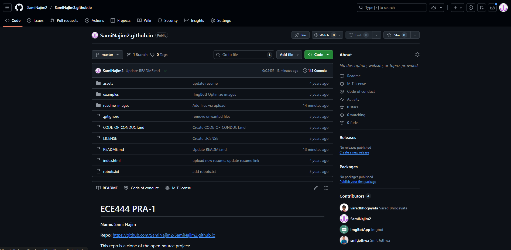
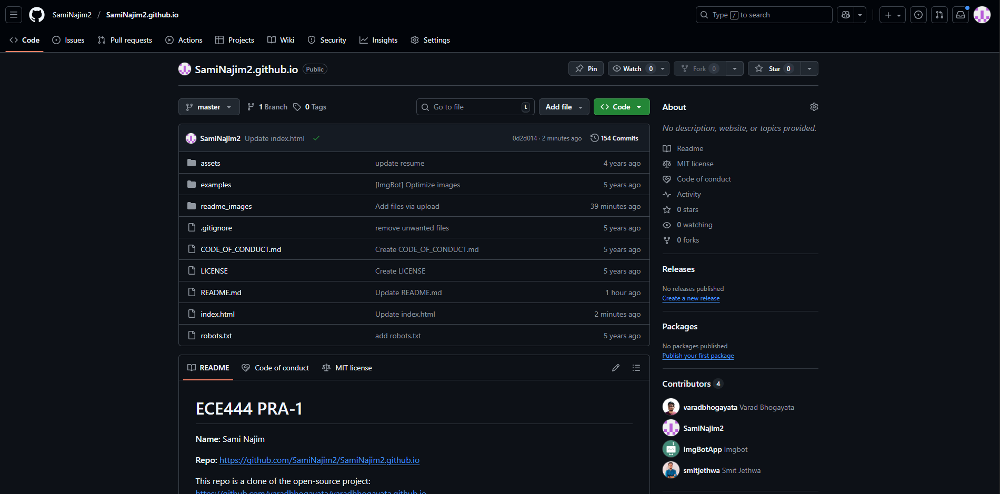
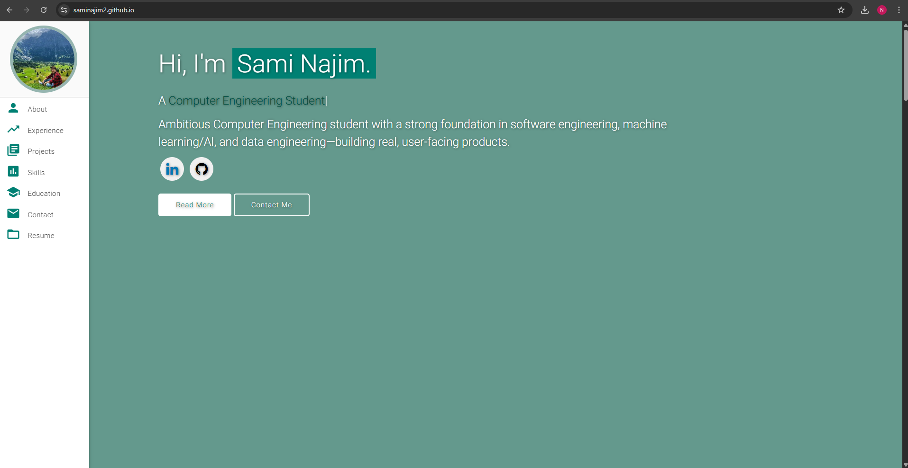
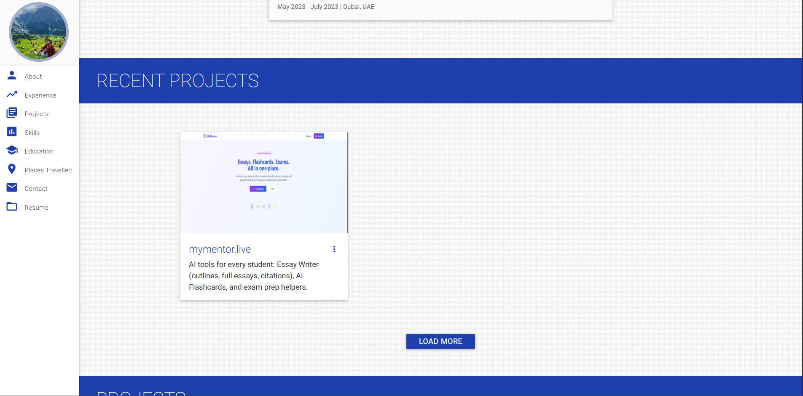

# ECE444 PRA-1 

**Name:** Sami Najim

**Repo:** https://github.com/SamiNajim2/SamiNajim2.github.io

This repo is a clone of the open-source project:  
https://github.com/varadbhogayata/varadbhogayata.github.io

## Activity 1
Screenshot of my repo after the initial commit:

## Activity 2
Screenshot of my repo (after changing index.html):

Screenshot of the homepage of my deployed website:

## Activity 3
Screenshot of my repo (after changing style.css):

Screenshot of the homepage of my deployed website:

## Activity 4
Screenshot of my repo (after changing index.html):

Screenshot of Places Travelled section in my deployed website:

## Activity 5
Screenshot of my repo (after changing index.html):

Screenshot of "Recent Project" section in my deployed website (Dynamic Content):

